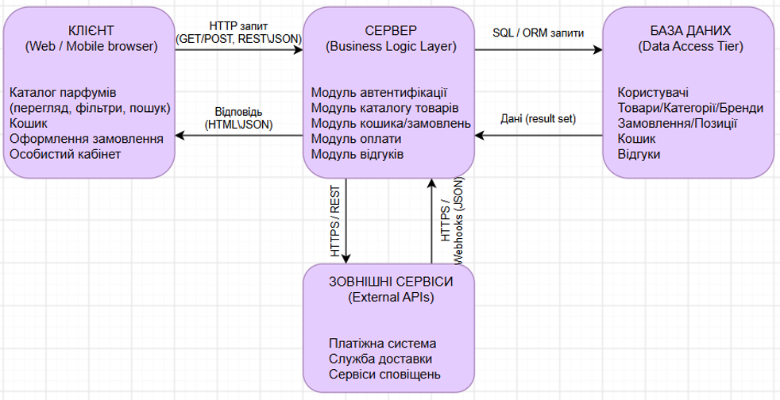
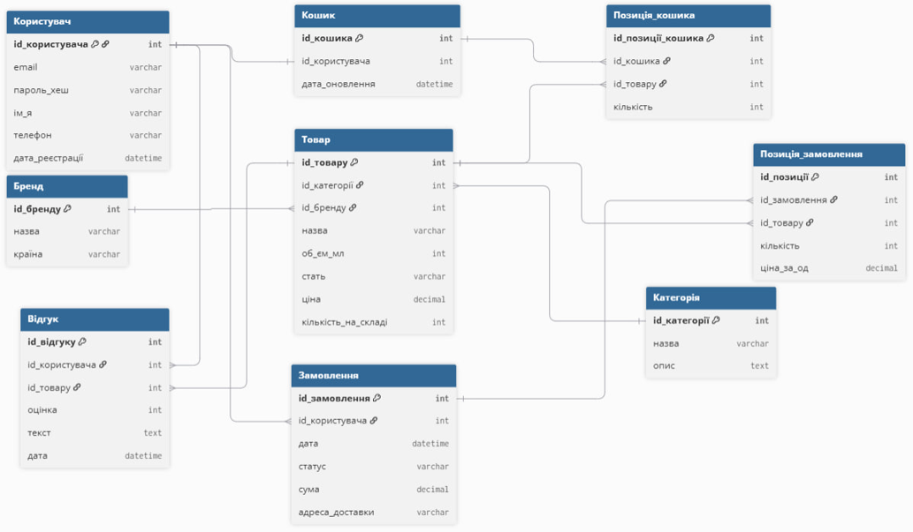
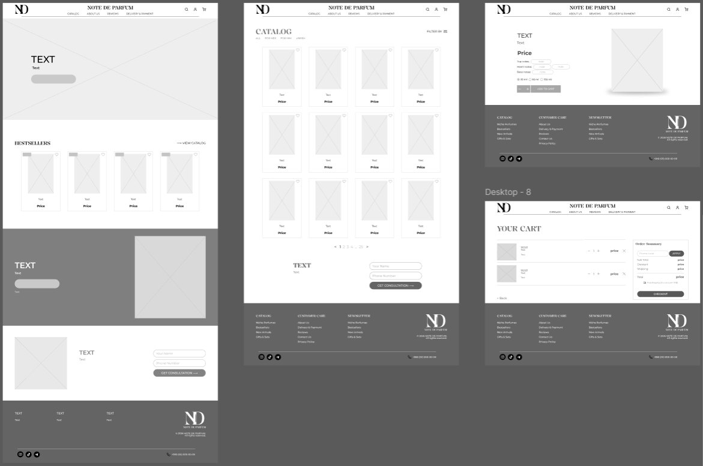
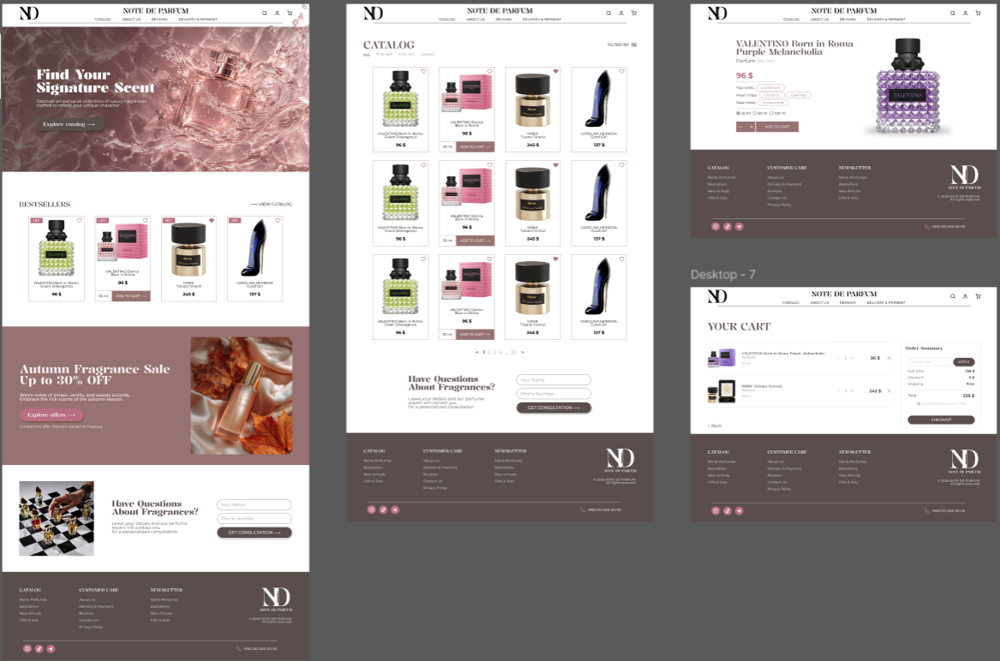

# Матеріали та результати виконання Лабораторної роботи №3

### Архітектурний стиль та архітектурна діаграма
Для інтернет-магазину парфумерії «Note De Parfum» обрано трирівневу клієнт-серверну архітектуру (3-tier architecture). Вона забезпечує високий рівень безпеки завдяки ізоляції бази даних, а також хорошу масштабованість та простоту супроводу системи. Надійна взаємодія між клієнтським застосунком, сервером бізнес-логіки, базой даних та зовнішніми API представлена на розробленій архітектурній діаграмі.

### ER-діаграма бази даних
База даних розроблена у третій нормальній формі (3NF) та складається з 9 основних сутностей для повноцінного функціонування інтернет-магазину. Вона охоплює збереження даних про користувачів, товари, бренди, категорії, кошик, замовлення та відгуки. Структура таблиць та кардинальність зв'язків між ними детально відображені на ER-діаграмі.

### Каркас UI/UX (Wireframe Design)
Розроблено низькодеталізовані макети (Wireframes) для основних сторінок системи: головної сторінки, каталогу товарів, картки товару та кошика. На цьому етапі було прораховано інформаційну архітектуру, розташування сітки елементів, логіку навігації та взаємодію користувача з інтерфейсом до етапу графічного оформлення.

### Макет UI/UX (Mockup Design)
На основі каркасів створено фінальні статичні макети (Mockups) із деталізацією візуального стилю бренду. Інтерфейс виконано у мінімалістичній преміальній кольоровій гамі з використанням елегантної типографіки, опрацьованими кнопками, тегами та інтерактивними елементами вибору параметрів товарів.

